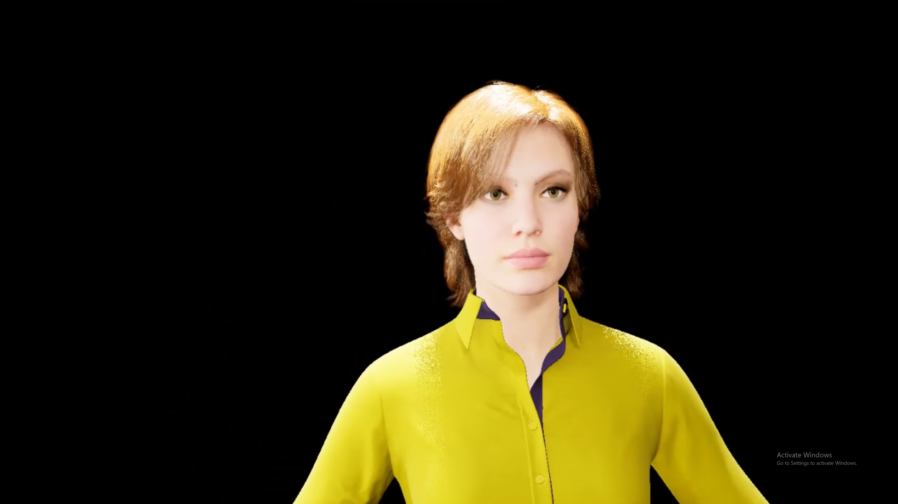
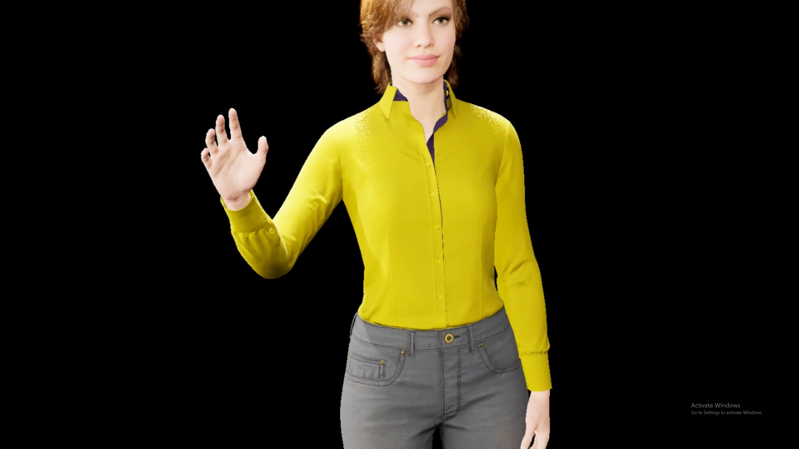
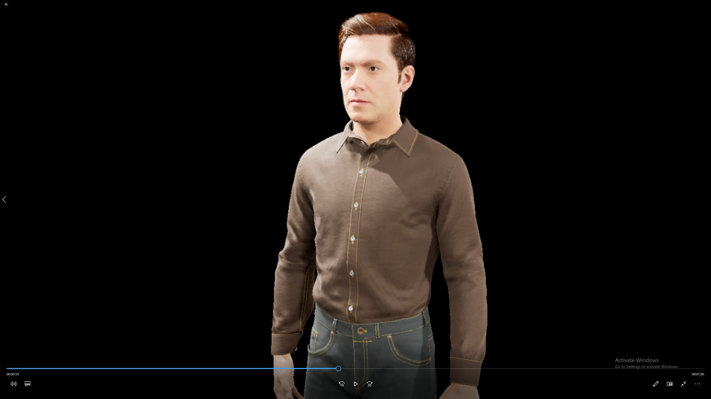
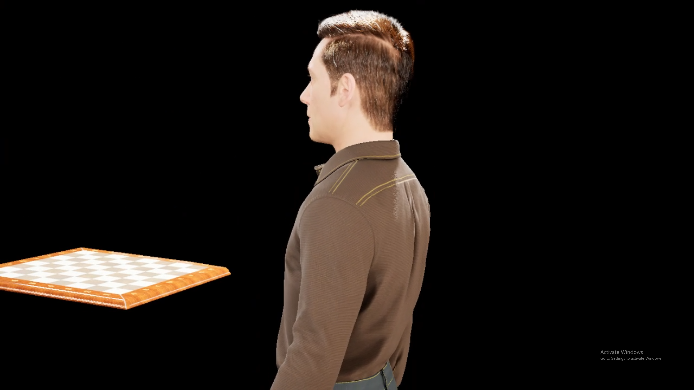

# MetaHumanHoloLens2

## Description
This is a student prauticum developed in TU Wien, mainly to render a high-quality model named Unreal MetaHuman on a high-performance PC then stream it to the Hololens2.

Meanwhile verify and test some other basic functions such as Spatial Mapping, Speech Recognition, Interaction...

## Requirements
Unreal 4.27.2

HoloLens 2

MetaHuman https://www.unrealengine.com/en-US/digital-humans?sessionInvalidated=true

Bridge https://quixel.com/bridge
### Plugins
UXTools https://github.com/microsoft/MixedReality-UXTools-Unreal

GraphicsTools https://github.com/microsoft/MixedReality-GraphicsTools-Unreal

## Screenshots

